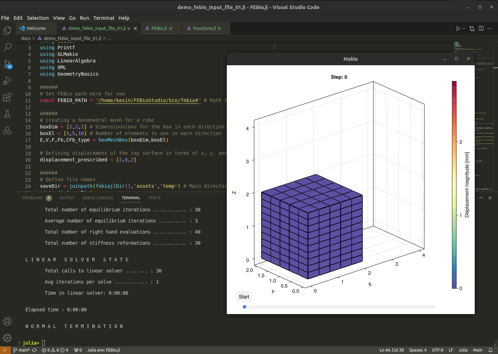

# FEBio.jl: A julia wrapper for FEBio
This projects aims to provide a Julia interface to the [FEBio](https://febio.org/) finite element solver. 

# Installation
## Simple installation
The following adds the latest version to your Julia environment. 
```julia
julia> ]
(@v1.xx) pkg> add https://github.com/febiosoftware/FEBio.jl
```
## Installation for testing, viewing examples, and co-development 
If you would like to see all the package files and examples (and perhaps also develop/change some of the functionality and examples), you can use the following to get the latest version: 
* Create a folder, e.g. named `dev_FEBio` (a folder to view and develop FEBio.jl in)
* Open a terminal and navigate to this new folder.
* Trigger Julia here by calling `julia`
* From Julia now enter the following to activate 
```julia
julia> ]
(@v1.xx) pkg> activate .
```
This will create and activate a new environment called `dev_FEBio`. 
* Now FEBio.jl can be added "for development" to this environment using: 
```julia
julia> ]
(@dev_Comodo) pkg> dev --local https://github.com/febiosoftware/FEBio.jl
```
* Other packages can now be added to this environment as desired, e.g. [Comodo.jl](https://github.com/COMODO-research/Comodo.jl).
* Next if one is working in an editor like VS Code or Codium, one can open the `dev_Comodo` folder there to start using this environment. 

## Adding/installing FEBio
Currently FEBio.jl does not ship with the FEBio binaries. Instead users should either obtain them from [the FEBio website](https://febio.org/), or compile their own using the [FEBio source](https://github.com/febiosoftware/FEBio). 
No special configuration is required at present. However, users do need to specify the path to the FEBio executable at the top of their code, e.g.: 
```julia
const FEBIO_PATH = "/home/kevin/FEBioStudio/bin/febio4" # Path to FEBio executable
```
Next febio can be called to run the analysis for the input file `filename_FEB` using: 
```julia
# Run FEBio
runMonitorFebio(filename_FEB,FEBIO_PATH)
```

# Getting started
The `examples` folder contains several demos on the use of FEBio from Julia with FEBio.jl. For instance [`demo_febio_0001_cube_uniaxial_hyperelastic.jl`](https://github.com/febiosoftware/FEBio.jl/blob/main/examples/demo_febio_0001_cube_uniaxial_hyperelastic.jl) which features a demonstration for uniaxial loading of a hyperelastic solid cube. 

Users are encouraged to use FEBio.jl in combination with the Julia package [Comodo](https://github.com/COMODO-research/Comodo.jl) which enables automated geometry processing, meshing, and boundary conditions specification. 

 


# Documentation 
Under construction

# Testing 
Under construction

# Roadmap
A detailed roadmap is under construction but the below is a list of major components which are currently been worked on: 

- [x] Julia based .feb file creation, import, and editing  
- [x] Julia calls/triggers FEBio executable
- [ ] Julia monitors/polices FEBio simulation progress
- [x] Julia based log-file importing 
- [ ] Julia based .xplt-file importing 
- [ ] Ship with or download FEBio binaries upon package adding, and configure with FEBio.jl automatically  
- [ ] CI, testing, and documentation
- [ ] Create specialised FEBio visualization tools

# How to contribute? 
Your help would be greatly appreciated! If you can contribute please do so by posting a pull-request. 

# License 
This wrapper is released open source under the [Apache 2.0 license](https://github.com/febiosoftware/FEBio.jl/blob/main/LICENSE).
